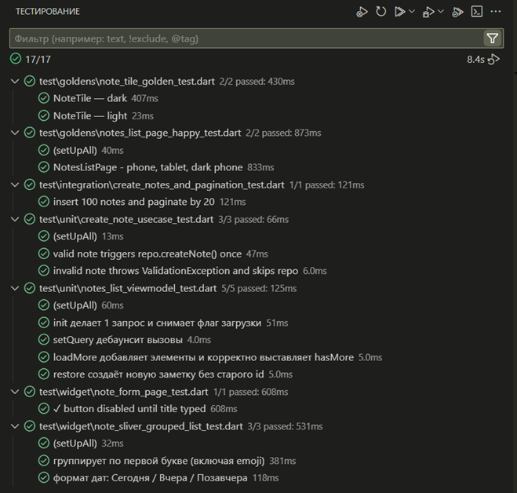

# NoteX

Небольшое Flutter‑приложение для ведения заметок.

---

## 🚀 Как запустить

```bash
flutter pub get
flutter pub run build_runner build
flutter run
```

> **Проверено:** Android, Web, Windows

---
## 🧱 Архитектура

В основе лежит **Clean Architecture**, разделённая по фичам и слоям:

```
lib/
├── core/           # общие модули и типы
├── di/             # DI-провайдеры
├── settings/       # простая feature
└── notes/          # основная feature
    ├── domain/     # сущности и абстракции репозиториев
    ├── app/        # use-case'ы, валидация, типы
    ├── data/       # Drift-DAO, модели, реализация репозитория
    └── presentation/
        ├── list/   # виджеты списка
        ├── viewmodel/   # StateNotifier'ы и State-объекты
        └── …       # виджеты экранов страниц
```

---

## ✨ Особенности

- **Поиск** с подсветкой совпадений.
- **Сортировка** по дате создания, обновления, алфавиту. Заголовки группируются (A, Б, Сегодня…).
- **Пагинация** поддерживает бесконечную прокрутку, работает при поиске.
- **Удаление** через кнопку отмены в SnackBar.
- **Тема оформления** системная / светлая / тёмная.
- **Кроссплатформенность** локального хранилища с использованием drift (SQLite для нативных платформ и IndexedDB для Web).

---

## ⚙️ Генерация кода

```bash
flutter pub run build_runner build --delete-conflicting-outputs
```

### 🧪 Запуск тестов

```bash
flutter test
```

<p>
  
</p>

---

## 🛠️ Debug‑функция: генерация фейковых заметок

| Действие                                 | Результат                                                                                                          |
| ---------------------------------------- | ------------------------------------------------------------------------------------------------------------------ |
| **Долгое нажатие** на иконку ⚙️ в AppBar | Появляется диалог с предложением сгенерировать случайные заметки (через [`faker`](https://pub.dev/packages/faker)) |

📎 Используется метод `NotesListViewModel.generateFake(count)`
→ доступен только в **debug‑сборках**.